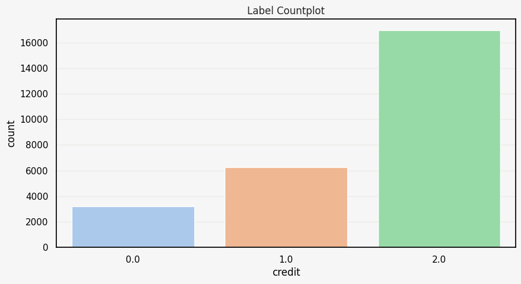

# 2024-1-DSCD-A--3

**2024-1 데이터사이언스 캡스톤디자인 A아이들 팀 저장소: 신용카드 연체 예측 1차 노트북**

노트북 3.1절 출력: 타깃 변수 `credit`(0/1/2)의 분포

## 메인 프로젝트

**팀의 캡스톤 메인 프로젝트는 [CSID-DGU/2024-1-DSCD-A_IDLE-3](https://github.com/CSID-DGU/2024-1-DSCD-A_IDLE-3)(생성형 AI 블로그 콘텐츠 자동화)입니다.** 이 저장소에는 캡스톤 초기에 Colab에서 작성한 연습용 노트북 하나만 들어 있습니다.

## 내용

[`신용카드_연체_예측_1차.ipynb`](신용카드_연체_예측_1차.ipynb)

신용카드 사용자의 대금 연체 정도(`credit`, 3개 클래스)를 분류하는 튜토리얼 형식의 노트북입니다. 노트북 머리말에는 데이크루 6기 '1등예정팀' 이름이 적혀 있습니다.

| 단계 | 노트북에서 한 일 |
|---|---|
| 데이터 탐색·전처리 | 결측치 대치, 불필요한 컬럼 제거, 연속형 변수 전처리 |
| EDA | 타깃 분포, 범주형·수치형 변수별 타깃 분포, 상관관계 분석 |
| 특징 공학 | Z-score 기반 이상치 제거 |
| 학습 | 레이블 인코딩, train/test 분리, MinMaxScaler, `DecisionTreeClassifier` |
| 검증 | K-Fold 교차 검증, 혼동 행렬, Accuracy·Precision·Recall·F1 |
| 튜닝 | SMOTE 오버샘플링, `RandomizedSearchCV` 후 재학습·재검증 |
| 마무리 | 최종 예측과 submission 파일 생성 |

## 실행

노트북은 Google Colab에서 Google Drive를 마운트해 `train.csv`, `test.csv`, `sample_submission.csv`를 읽도록 작성되어 있습니다. 데이터 파일은 저장소에 포함되어 있지 않습니다. 위의 **Open in Colab** 버튼으로 열고, 데이터 경로를 본인 Drive 위치에 맞춰 수정한 뒤 실행하면 됩니다.

## 기술 스택

- Python, Jupyter / Google Colab
- pandas, NumPy, SciPy
- Matplotlib, Seaborn
- scikit-learn, imbalanced-learn (SMOTE)

---

Made by <a href="https://github.com/khwee2000">김민수 (@khwee2000)</a>

